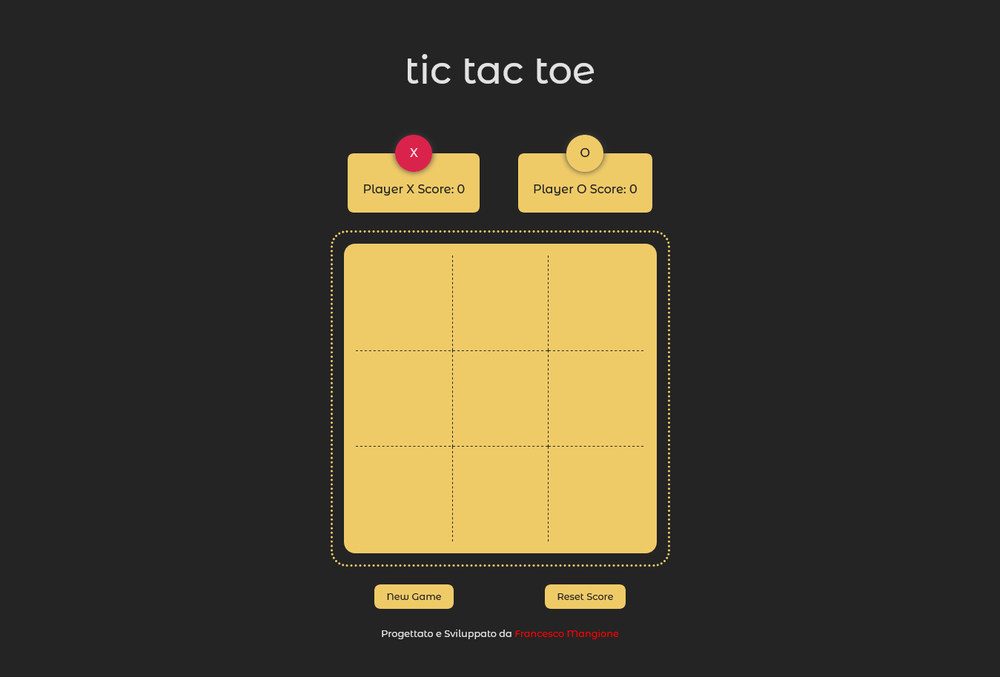

### Tic Tac Toe</br>

A simple app where you can plaing with tic tac toe game .

## Table of Contents

[General info](#general-info)</br>
[Technologies](#technologies)</br>
[Setup](#setup)</br>

### General info

This app has been developed with Vue.js 3, Vuex for state management and Motion one.

- Show players.
- Players' scores.
- New game and reset score button.



### Technologies

- [Vue.js](https://vuejs.org/)
- [Javascript](https://developer.mozilla.org/en-US/docs/Web/JavaScript?retiredLocale=it)
- [Vite](https://vitejs.dev/guide/)
- [Vuex](https://vuex.vuejs.org/)
- [Motion One](https://motion.dev/vue/quick-start)

### Setup

Download [Node](https://nodejs.org/en/) and installed it on your operating system like windows or mac.

1. Clone the repository on local server:

   ```sh
   git clone https://github.com/francescoup/
   ```

2. Install NPM packages:

   ```sh
   npm install
   ```

3. Build from source:

   ```sh
   npm run build
   ```

4. Run the live server:
   git

   ```sh
   npm run dev
   ```

   ```

   ```

## License

Distributed under the MIT License.

## Links

You can see the app at the following link:

Live Site: [Tic Tac Toe](https://vue-tris-game.netlify.app/)</br>

## Contact

Contact me on: [f.mangione@live.com](mailto:f.mangione@live.com)  
Linkedin profile here: [https://www.linkedin.com/in/francesco-mangione/](https://www.linkedin.com/in/francesco-mangione/)
